# AI-Powered Dependency Management System

```
Submitted by:
```
## Sanjyot Satvi {.unnumbered}

## 885146977 {.unnumbered}

```
California State University, Fullerton
```
### CPSC-597 {.unnumbered}

```
Spring 2025
```
```
Advisor: Prof. Rong Jin
```
```
Department of Computer Science
```


## ABSTRACT {.unnumbered}

This project presents the design and implementation of an AI-Powered Dependency Management System aimed at enhancing software security through intelligent vulnerability analysis and automated risk assessment. Traditional dependency management tools like Dependabot and Renovate create pull requests for outdated packages but fail to provide developers with contextual risk assessment, leaving them to manually research and evaluate vulnerability severity. This often results in alert fatigue and delayed security patches.

To address these challenges, the system employs a microservice architecture integrating OpenAI's GPT-4 model to analyze vulnerabilities detected via the Open Source Vulnerabilities (OSV) database. The AI component generates user-friendly explanations of complex security issues, provides severity assessments with confidence scores, and breaks down analysis factors including exploitability, patch availability, and vulnerability age.

The solution includes a modern web dashboard built with React and TypeScript, a Node.js/Express backend for API management and GitHub OAuth integration, RabbitMQ for asynchronous job processing, and a Python FastAPI service for AI-powered analysis. MongoDB serves as the primary data store for scan results and AI-generated insights. Real-time updates are delivered via WebSocket connections, ensuring users receive immediate feedback on scan progress and analysis completion.

By combining automated vulnerability detection with AI-powered risk contextualization, the system empowers developers to make faster, more informed decisions about dependency updates, ultimately reducing the window of exposure to security vulnerabilities.


## Table of Contents {.unnumbered}

1. INTRODUCTION
2. REQUIREMENTS DESCRIPTION
3. DESIGN DESCRIPTION
4. IMPLEMENTATION
5. TEST AND INTEGRATION
6. INSTALLATION INSTRUCTIONS
7. OPERATING INSTRUCTIONS
8. RECOMMENDATIONS FOR ENHANCEMENTS
9. REFERENCES

## Table of Figures {.unnumbered}

1. AI DEPENDENCY MANAGEMENT SYSTEM ARCHITECTURE
2. TECHNOLOGIES AND FRAMEWORKS
3. GITHUB OAUTH LOGIN PAGE
4. REPOSITORY SELECTION PAGE
5. SCAN CONFIGURATION & ONBOARDING
6. SCAN PROGRESS VIEW WITH REAL-TIME UPDATES
7. SCAN RESULTS DASHBOARD
8. DEPENDENCIES LIST VIEW
9. VULNERABILITY LIST WITH SEVERITY BADGES
10. AI-GENERATED VULNERABILITY DESCRIPTION
11. AI SEVERITY RATING WITH CONFIDENCE SCORE
12. ANALYSIS FACTORS BREAKDOWN
13. REAL-TIME WEBSOCKET NOTIFICATIONS
14. RABBITMQ MANAGEMENT INTERFACE
15. PYTHON SERVICE HEALTH CHECK STATUS
16. AI SERVICE PROCESSING LOGS


## INTRODUCTION

**1.1 Description of the Problem**

In modern software development, dependency management has evolved from a routine maintenance task into a critical security concern. Applications today rely on hundreds or thousands of third-party packages, each potentially introducing security vulnerabilities that can expose systems to attacks. The average Node.js application contains over 1,000 transitive dependencies, and studies show that 84% of codebases contain at least one known vulnerability in their open-source dependencies.

Existing dependency management tools like GitHub Dependabot, Snyk, and Renovate Bot have automated the process of detecting outdated packages and creating pull requests. However, these tools present a significant limitation: they generate alerts without contextual risk assessment. Developers receive notifications about vulnerabilities with CVSS scores but lack the expertise or time to evaluate the actual risk to their specific application.

This creates several critical problems:

**Alert Fatigue:** Development teams are overwhelmed by the volume of security alerts, leading to delayed responses or ignored warnings. A single project update can generate dozens of pull requests, each requiring manual investigation.

**Knowledge Gap:** Understanding CVE details, attack vectors, and exploitation complexity requires specialized security knowledge that most developers don't possess. Terms like "remote code execution via prototype pollution" are technically accurate but unhelpful for decision-making.

**Inconsistent Prioritization:** Without clear risk context, teams struggle to prioritize which vulnerabilities to address first. A critical vulnerability in an unused code path may receive the same attention as a moderate vulnerability in production-critical functionality.

**Resource Inefficiency:** Developers spend significant time researching vulnerabilities on security databases, reading CVE reports, and assessing whether patches break compatibility—time that could be spent on feature development.

These inefficiencies ultimately delay the remediation of genuine security threats, leaving applications vulnerable to exploitation longer than necessary.

**1.2 Objective**

The primary objective of this project is to design and implement an AI-Powered Dependency Management System that leverages large language models to transform raw vulnerability data into actionable security insights. The system aims to:

1. **Automate Vulnerability Detection:** Scan project dependency files (package.json, requirements.txt) and identify all known vulnerabilities using the Open Source Vulnerabilities (OSV) database.

2. **Generate Human-Readable Explanations:** Use GPT-4 to translate technical CVE descriptions into clear, concise explanations that developers can understand without security expertise.

3. **Provide AI-Powered Risk Assessment:** Analyze multiple factors (CVSS score, exploitability, patch availability, vulnerability age) to generate severity ratings with confidence scores, helping teams prioritize remediation efforts.

4. **Enable Real-Time Monitoring:** Deliver immediate feedback on scan progress and analysis results through WebSocket connections, eliminating the need for manual refresh or polling.

5. **Support Informed Decision-Making:** Present comprehensive analysis factors that explain why a particular severity rating was assigned, enabling developers to validate or override AI recommendations based on their application context.

6. **Integrate with Developer Workflows:** Provide seamless GitHub OAuth authentication and repository selection, fitting naturally into existing development practices.

The overall goal is to reduce the mean time to remediation (MTTR) for dependency vulnerabilities by providing developers with the context they need to act quickly and confidently on security alerts.

**1.3 Development Environment (Software and Hardware)**

The development environment used for building the AI-Powered Dependency Management System includes:

**Software:**

- **Frontend:** React 19, TypeScript 5.7, Vite 6, Tailwind CSS 4
- **Backend:** Node.js 18+, Express 4.18, TypeScript 4.9
- **AI Service:** Python 3.10+, FastAPI, OpenAI API (GPT-4)
- **Message Queue:** RabbitMQ 3.x
- **Database:** MongoDB 6.x
- **Real-Time Communication:** Socket.IO 4.8
- **Containerization:** Docker, Docker Compose
- **IDE:** Visual Studio Code with ESLint, Prettier

**Hardware:**

- Development was conducted on local machines with:
    - Apple M1/M2 or Intel i7 Processor
    - 16GB RAM
    - macOS 13+ / Ubuntu 22.04
    - Docker Desktop for containerization


## REQUIREMENTS DESCRIPTION

**2.1 Functional Requirements (External Functions)**

The system provides the following core external functions accessible to users (primarily software developers, DevOps engineers, and security teams):

- **GitHub Authentication:** Secure login via GitHub OAuth 2.0, enabling access to user's repositories without storing credentials. JWT tokens maintain session state.

- **Repository Management:**
    - Fetch and display all repositories accessible to the authenticated user
    - Select repositories for vulnerability scanning
    - Configure scan schedules (daily, weekly, monthly)
    - Set up notification preferences (email, Slack)

- **Dependency Scanning:**
    - Parse dependency lock files (package-lock.json, yarn.lock, requirements.txt)
    - Identify direct and transitive dependencies
    - Query OSV database for known vulnerabilities
    - Track dependency versions (current vs. latest available)

- **AI-Powered Vulnerability Analysis:**
    - Generate plain-English descriptions of vulnerabilities suitable for non-security experts
    - Provide AI-determined severity ratings (critical, high, medium, low, info)
    - Calculate confidence scores (0-100%) for severity assessments
    - Extract and display analysis factors:
        - CVSS base score impact
        - Exploitability assessment
        - Package criticality in dependency tree
        - Patch availability status
        - Vulnerability age (days since disclosure)
        - Detailed reasoning for the assessment

- **Real-Time Progress Updates:**
    - WebSocket-based notifications for scan progress
    - Immediate display of AI analysis results as they complete
    - Error notifications with actionable guidance

- **Results Visualization:**
    - Dashboard overview of scan statistics
    - Filterable lists of dependencies and vulnerabilities
    - Detailed views with expandable analysis sections
    - Severity badges for quick visual identification

**2.2 System Interfaces**

- **Web-Based Dashboard Interface:** The primary interface is an interactive single-page application (SPA) built with React, providing access to all system functions. Key interface pages include:
    - **Login Page:** GitHub OAuth authentication with secure redirect handling
    - **Repository Selection Page:** Browse and select repositories to scan
    - **Onboarding/Configuration Page:** Set scan frequency and notification preferences
    - **Scan Results Page:** View all scanned dependencies with vulnerability counts
    - **Vulnerability Details Page:** Expanded view with AI-generated analysis, severity ratings, and factor breakdowns

- **Backend API Services Interface:** A RESTful API layer (Node.js/Express) facilitates communication between the frontend and backend services. This interface handles:
    - Authentication endpoints (login, callback, logout, session validation)
    - Repository endpoints (fetch from GitHub, list user repos, get repo details)
    - Scan endpoints (initiate scan, get scan status, retrieve results)
    - Onboarding endpoints (save configuration, check status)

- **AI Service Interface:** A FastAPI-based Python microservice provides:
    - Health check endpoint for monitoring
    - Status endpoint for detailed service information
    - Manual analysis endpoint for testing and debugging

- **Message Queue Interface:** RabbitMQ enables asynchronous communication:
    - `ai_vulnerability_analysis` queue for processing vulnerabilities
    - `websocket_notifications` queue for frontend updates

- **External API Interfaces:**
    - **GitHub API:** Repository listing, OAuth authentication, webhook registration
    - **OSV API:** Open Source Vulnerability database queries
    - **OpenAI API:** GPT-4 model access for AI analysis


## DESIGN DESCRIPTION

**3.1 System Architecture**

The AI-Powered Dependency Management System employs a microservice architecture designed for scalability, reliability, and separation of concerns. It comprises five main components:

- **Frontend Layer:** Built using React 19 with TypeScript, delivering a responsive, type-safe web interface. The frontend communicates with the backend via REST APIs and receives real-time updates through WebSocket connections. Tailwind CSS provides utility-first styling, and Framer Motion enables smooth animations for enhanced user experience.

- **Backend API Layer:** Powered by Node.js and Express, this layer serves as the central coordinator. It handles authentication, repository management, dependency scanning, and vulnerability detection. The backend publishes analysis jobs to RabbitMQ and manages WebSocket connections for real-time updates.

- **Message Queue Layer:** RabbitMQ provides reliable asynchronous communication between the Node.js backend and Python AI service. This decoupling ensures the API remains responsive while AI analysis processes in the background, and enables horizontal scaling of AI workers.

- **AI Analysis Layer:** A Python FastAPI service consumes messages from RabbitMQ, processes vulnerabilities through GPT-4, and updates results in MongoDB. The service includes retry logic, error handling, and health monitoring for production reliability.

- **Database Layer:** MongoDB stores all structured data including user profiles, repository metadata, scan results, and AI-generated analyses. The document model efficiently represents hierarchical vulnerability data with nested analysis fields.

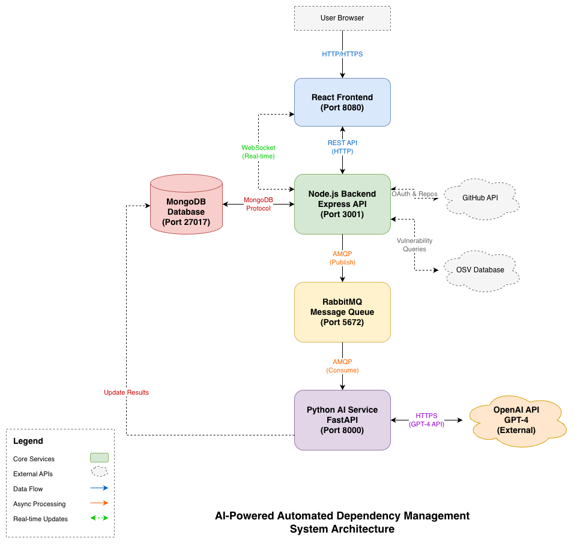{width=90%}

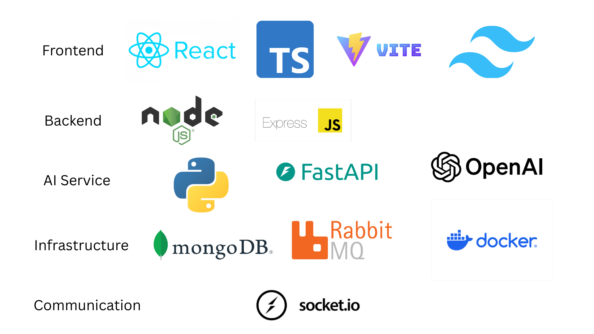{width=90%}

**3.2 Component Descriptions**

- **3.2.1 Frontend Component**

    - **Technology:** React 19 with TypeScript 5.7, built using Vite 6 for fast development and optimized production builds. Tailwind CSS 4 provides styling, Framer Motion handles animations, and React Router v7 manages client-side routing.

    - **Internal Functions:**
        - Renders scan results and vulnerability data from backend API
        - Manages authentication state via React Context
        - Establishes WebSocket connections for real-time updates
        - Displays AI-generated descriptions, severity badges, and confidence scores
        - Provides filtering and navigation for dependency/vulnerability lists

    - **Internal Interfaces:** Communicates with the Node.js backend via Axios HTTP client for REST API calls and Socket.IO client for WebSocket events. Type definitions ensure type safety across API boundaries.

- **3.2.2 Backend Component**

    - **Technology:** Node.js 18+ with Express 4.18 and TypeScript 4.9. Uses Mongoose for MongoDB ODM, amqplib for RabbitMQ, Socket.IO for WebSocket server, and Winston for structured logging.

    - **Internal Functions:**
        - Authenticates users via GitHub OAuth 2.0 and issues JWT tokens
        - Fetches repository lists from GitHub API
        - Parses dependency lock files to extract package information
        - Queries OSV API for vulnerability data
        - Publishes vulnerability analysis jobs to RabbitMQ
        - Manages WebSocket connections and broadcasts updates
        - Stores and retrieves scan results from MongoDB

    - **Internal Interfaces:** Exposes RESTful endpoints for the frontend, connects to MongoDB via Mongoose, publishes to RabbitMQ queues, and emits WebSocket events. Also interfaces with GitHub API and OSV API.

- **3.2.3 AI Analysis Component**

    - **Technology:** Python 3.10+ with FastAPI for the web framework, Pika for RabbitMQ consumption, PyMongo for database access, and the OpenAI Python SDK for GPT-4 integration.

    - **Internal Functions:**
        - **Queue Consumer:** Listens to `ai_vulnerability_analysis` queue and processes messages
        - **Description Generation:** Creates user-friendly explanations of vulnerabilities using GPT-4
        - **Severity Analysis:** Analyzes multiple factors to determine AI severity rating with confidence score
        - **Database Updates:** Writes analysis results back to MongoDB scan documents
        - **Health Monitoring:** Provides /health and /status endpoints for service monitoring
        - **Error Handling:** Implements retry logic with exponential backoff for API failures

    - **Internal Interfaces:** Consumes from RabbitMQ, queries OpenAI API, updates MongoDB, and exposes HTTP endpoints for health checks.

- **3.2.4 Database Component**

    - **Technology:** MongoDB 6.x, a document-oriented NoSQL database well-suited for storing hierarchical scan results with nested vulnerability and analysis data.

    - **Internal Functions:** Stores and retrieves:
        - User profiles (GitHub ID, tokens, preferences)
        - Repository metadata
        - Scan documents with dependencies and vulnerabilities
        - AI analysis results (descriptions, severity, confidence, factors)

    - **Internal Interfaces:** Accessed by Node.js backend via Mongoose ODM and Python service via PyMongo driver.

- **3.2.5 Message Queue Component**

    - **Technology:** RabbitMQ 3.x, a robust message broker implementing AMQP protocol.

    - **Internal Functions:**
        - Receives vulnerability analysis jobs from Node.js backend
        - Queues messages for consumption by Python AI service
        - Ensures reliable delivery with acknowledgments
        - Enables horizontal scaling of AI workers

    - **Internal Interfaces:** Receives from Node.js (amqplib), consumed by Python (Pika).

**3.3 Internal Functions and Logic**

- **Vulnerability Detection Logic:** The backend scans dependencies by:
    1. Parsing lock files to extract package names and versions
    2. Building a dependency tree with direct and transitive dependencies
    3. Querying OSV API in batches for known vulnerabilities
    4. Matching vulnerability affected versions against installed versions
    5. Storing raw vulnerability data with CVSS scores and references

- **AI Analysis Pipeline:** For each detected vulnerability:
    1. Node.js publishes a message containing vulnerability data, package info, and context
    2. Python service consumes the message and extracts relevant fields
    3. GPT-4 generates a 2-3 sentence explanation suitable for developers
    4. GPT-4 analyzes severity factors and returns structured JSON with:
        - AI-determined severity (critical/high/medium/low/info)
        - Confidence percentage (0-100)
        - Analysis factors with reasoning
    5. Results are written to MongoDB and WebSocket notification is sent

- **Confidence Score Calculation:** The AI considers:
    - Completeness of vulnerability data
    - Consistency with CVSS score
    - Availability of exploitation evidence
    - Clarity of affected versions

**3.4 Internal Data Flow**

The typical data flow for a complete vulnerability scan is:

1. User authenticates via GitHub OAuth and selects a repository
2. Frontend sends scan request to Node.js backend
3. Backend fetches repository content from GitHub API
4. Dependency lock file is parsed to extract all packages
5. OSV API is queried for vulnerabilities affecting each package
6. Scan document is created in MongoDB with initial data
7. For each vulnerability, a message is published to RabbitMQ
8. Backend responds to frontend with scan ID and initial results
9. Python AI service consumes messages from queue
10. GPT-4 generates description and severity analysis
11. Analysis results are saved to MongoDB
12. WebSocket notification is sent to frontend
13. Frontend updates display with AI-generated content
14. User views complete analysis with severity ratings and explanations


## IMPLEMENTATION

**4.1 Authentication Implementation**

The authentication module enables secure access to the system through GitHub OAuth 2.0, ensuring users can connect their GitHub accounts without exposing credentials.

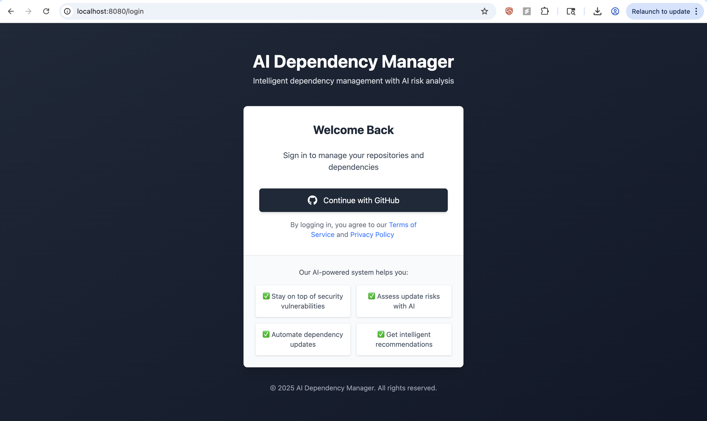{width=80%}

**A. GitHub OAuth Flow**

- **Frontend Integration:**
    - Login button redirects to GitHub authorization URL
    - GitHub prompts user to authorize the application
    - Callback redirect returns authorization code to backend

- **Backend Processing:**
    - Exchanges authorization code for access token
    - Fetches user profile from GitHub API
    - Creates or updates user record in MongoDB
    - Issues JWT token for session management
    - Redirects to frontend with token

- **Session Management:**
    - JWT stored in HTTP-only cookie or localStorage
    - AuthContext in React maintains user state
    - Protected routes redirect unauthenticated users

**4.2 Repository Selection Implementation**

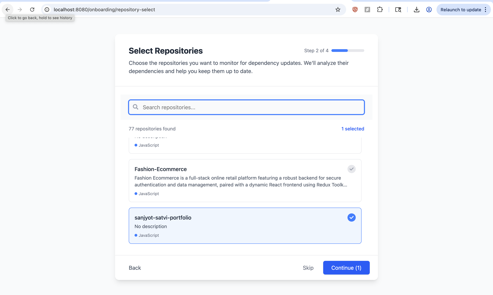{width=85%}

The repository selection page displays all repositories accessible to the authenticated user, fetched via the GitHub API.

- **API Integration:**
    - Backend calls GitHub API with user's access token
    - Fetches both owned and collaborated repositories
    - Caches results to reduce API calls

- **Frontend Display:**
    - Repositories sorted by last updated time
    - Displays name, description, language, stars
    - Allows selection for scanning
    - Pagination for users with many repositories

**4.3 Scan Configuration Implementation**

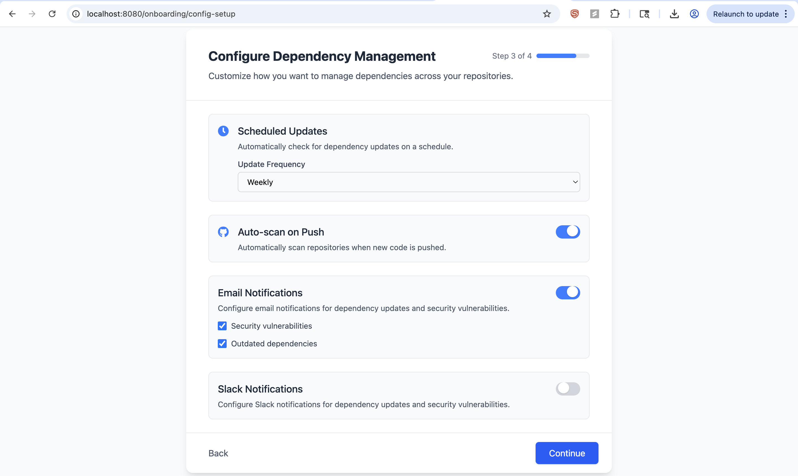{width=80%}

The onboarding module allows users to configure how and when scans should run.

- **Configuration Options:**
    - Scan frequency selection (cron-based scheduling)
    - Notification channels (email, Slack webhook URL)
    - Auto-scan trigger on GitHub push events
    - Webhook secret for secure communication

- **Backend Storage:**
    - Preferences stored in user/repository documents
    - Node-cron schedules recurring scans
    - Webhook endpoint validates GitHub signatures

**4.4 Scan Progress Implementation**

{width=85%}

Real-time scan progress is delivered through WebSocket connections, providing immediate feedback without polling.

- **WebSocket Integration:**
    - Socket.IO client connects on component mount
    - Joins room specific to scan ID
    - Receives progress events (dependencies found, vulnerabilities detected)
    - Updates UI state in real-time

- **Progress States:**
    - `pending`: Scan initiated
    - `scanning`: Parsing dependencies
    - `analyzing`: Querying OSV database
    - `processing`: AI analysis in progress
    - `completed`: All analysis finished
    - `failed`: Error occurred with message

**4.5 Scan Results Dashboard Implementation**

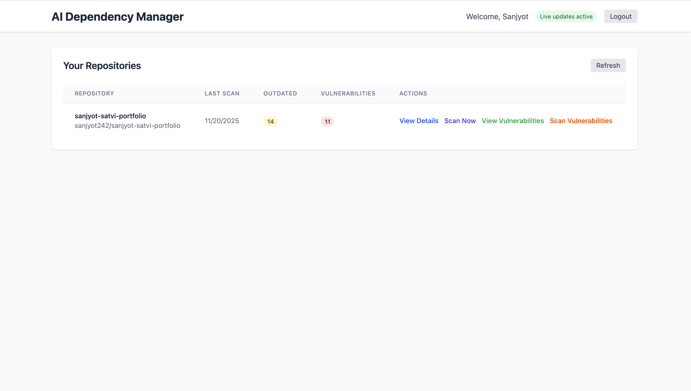{width=85%}

The results dashboard provides a high-level overview of the scan findings.

- **Summary Statistics:**
    - Total number of dependencies scanned
    - Count of dependencies with vulnerabilities
    - Breakdown by severity (critical, high, medium, low)
    - Percentage of up-to-date packages

- **Visual Indicators:**
    - Color-coded severity badges
    - Progress towards security goals
    - Comparison with previous scans (if available)

**4.6 Dependencies List Implementation**

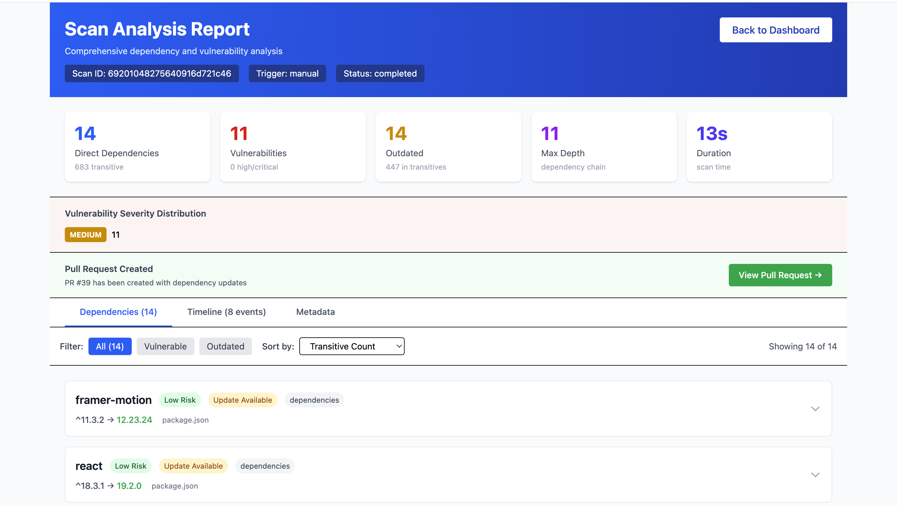{width=90%}

The dependencies list displays all packages found in the scanned project.

- **Data Display:**
    - Package name with link to npm/PyPI
    - Current installed version
    - Latest available version
    - Number of vulnerabilities found
    - Highest severity among vulnerabilities

- **Interaction:**
    - Click row to view detailed vulnerability list
    - Sort by name, version, vulnerability count, severity
    - Filter by has vulnerabilities / all packages

**4.7 Vulnerability List Implementation**

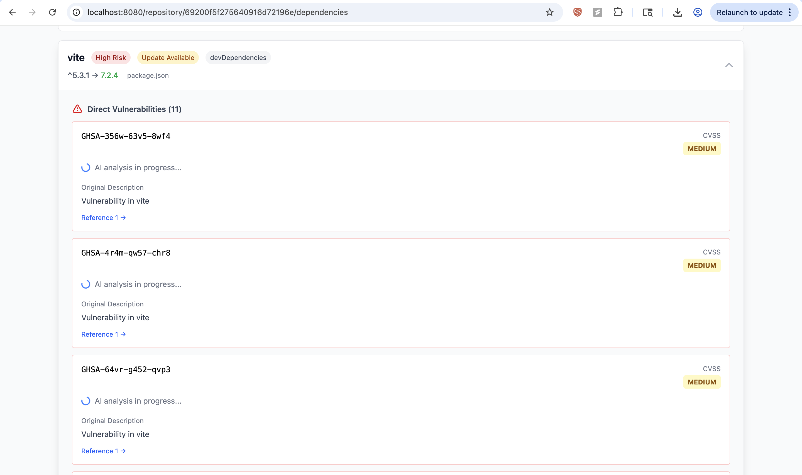{width=85%}

The vulnerability list shows all security issues affecting a specific dependency.

- **Vulnerability Data:**
    - CVE or GHSA identifier
    - Brief title from advisory
    - CVSS score and severity
    - Affected version ranges
    - Fixed version (if available)

- **AI Status Indicators:**
    - Spinner if analysis in progress
    - AI severity badge when complete
    - Error indicator if analysis failed

**4.8 AI Analysis Display Implementation**

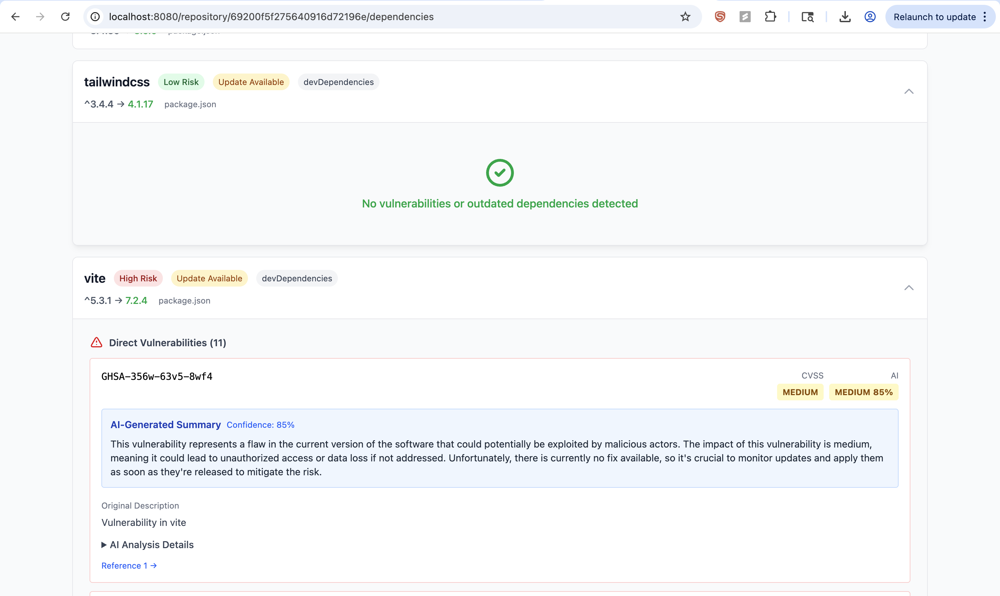{width=85%}

**A. AI-Generated Description**

The description component displays the GPT-4 generated explanation of the vulnerability.

- **Content Format:**
    - 2-3 concise sentences
    - Explains WHAT the vulnerability is
    - Describes potential IMPACT
    - Notes FIX availability

- **Example:**
    > "This vulnerability allows attackers to execute arbitrary code by sending specially crafted input that exploits prototype pollution in the lodash library. If exploited, an attacker could gain full control of the server running your application. A fix is available in version 4.17.21 or later."

{width=80%}

**B. AI Severity and Confidence**

The severity component shows the AI-determined risk level with confidence scoring.

- **Severity Levels:**
    - Critical (red): Immediate action required
    - High (orange): Prioritize remediation
    - Medium (yellow): Schedule for next sprint
    - Low (blue): Address when convenient
    - Info (gray): Minimal risk, informational

- **Confidence Score:**
    - Percentage from 0-100%
    - Higher confidence = more reliable rating
    - Low confidence may indicate incomplete data or edge cases

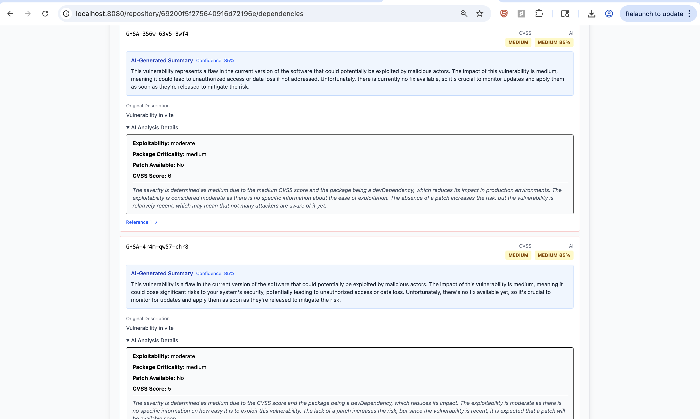{width=85%}

**C. Analysis Factors**

The factors breakdown explains why the AI assigned a particular severity rating.

- **Factor Categories:**
    - **CVSS Score Impact:** How the base score influenced the rating
    - **Exploitability:** Known exploits, PoC availability, attack complexity
    - **Package Criticality:** Direct vs transitive, usage frequency
    - **Patch Available:** Whether a fix exists and in which version
    - **Vulnerability Age:** Days since public disclosure
    - **Reasoning:** Detailed explanation combining all factors

- **Purpose:**
    - Transparency in AI decision-making
    - Enables developers to validate or override ratings
    - Educational value for security awareness

**4.9 Real-Time Updates Implementation**

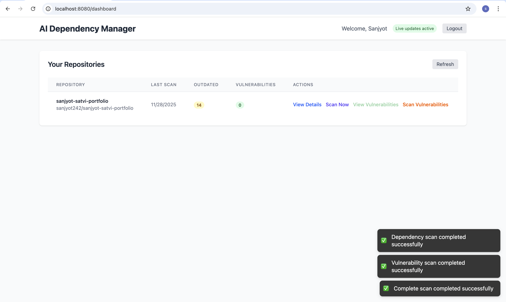{width=70%}

WebSocket integration provides immediate updates without page refresh.

- **Event Types:**
    - `scan:progress`: Updates progress indicator
    - `scan:complete`: Scan finished successfully
    - `scan:error`: Error occurred during scan
    - `analysis:complete`: Single vulnerability analyzed
    - `analysis:error`: AI analysis failed for item

- **Frontend Handling:**
    - WebSocketContext manages connection lifecycle
    - Components subscribe to relevant events
    - UI updates instantly on event receipt
    - Toast notifications displayed at bottom-right corner

**4.10 Message Queue Management**

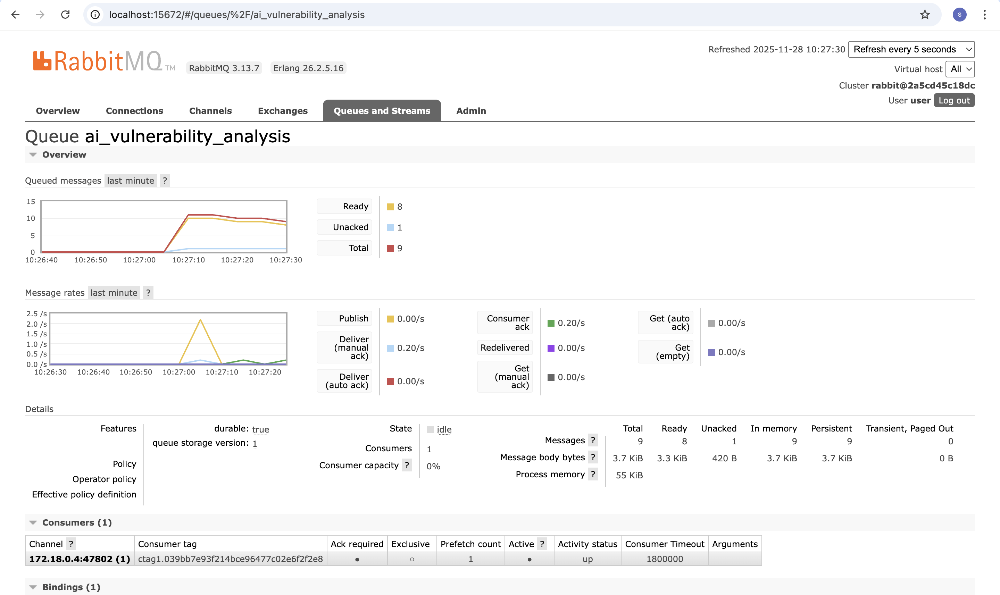{width=85%}

RabbitMQ provides a web-based management interface for monitoring message queues and system health.

- **Queue Monitoring:**
    - **ai_vulnerability_analysis queue:** Shows pending vulnerability analysis jobs
    - Message count (ready, unacknowledged, total)
    - Consumer count and processing rates
    - Message throughput (publish/deliver rates)

- **Management Features:**
    - View message details and payloads
    - Purge queues for testing
    - Monitor consumer connections
    - Track memory and resource usage

- **Access:**
    - Management UI available at http://localhost:15672
    - Default credentials: guest/guest (development only)
    - Provides real-time visibility into async job processing

- **Key Queues:**
    - `ai_vulnerability_analysis`: AI analysis jobs from Node.js to Python service
    - `websocket_notification`: Real-time notification events
    - `scan_complete_notification`: Scan completion events

**4.11 Health Monitoring Implementation**

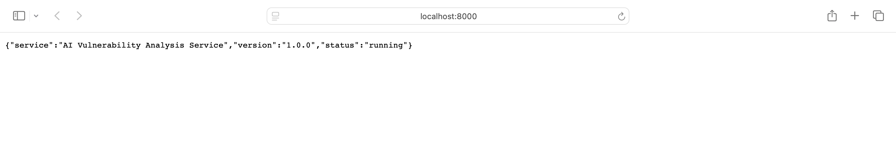{width=75%}

The Python AI service exposes health endpoints for monitoring.

- **Health Endpoint (/health):**
    - Returns service status
    - Checks RabbitMQ connection
    - Checks MongoDB connection
    - Verifies OpenAI API key configured

- **Status Endpoint (/status):**
    - Detailed service information
    - Message processing statistics
    - Error counts and rates
    - Uptime information

**4.12 AI Service Processing Logs**

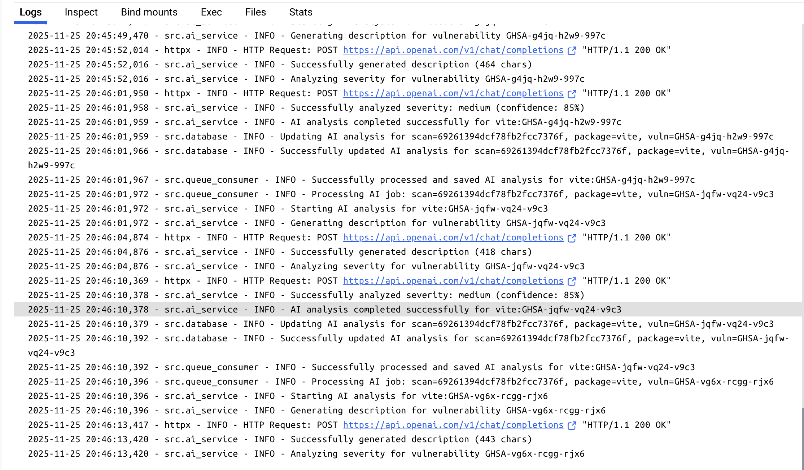{width=85%}

The Python AI service generates detailed logs during vulnerability analysis processing.

- **Log Categories:**
    - **Queue Consumption:** Logs when vulnerability analysis jobs are received from RabbitMQ
    - **GPT-4 API Calls:** Records requests sent to OpenAI API with prompt details
    - **Description Generation:** Shows AI-generated vulnerability explanations
    - **Severity Analysis:** Displays calculated severity ratings with confidence scores
    - **Database Updates:** Confirms successful storage of analysis results
    - **Processing Time:** Tracks time taken for each analysis (typically 3-5 seconds)

- **Example Log Flow:**
    1. `[INFO] Processing vulnerability analysis for CVE-2024-12345`
    2. `[INFO] Calling OpenAI API for description generation...`
    3. `[INFO] GPT-4 response received (2.3s)`
    4. `[INFO] Generated description: "This vulnerability allows..."`
    5. `[INFO] Calling OpenAI API for severity analysis...`
    6. `[INFO] AI Severity: HIGH (confidence: 85%)`
    7. `[INFO] Analysis complete, updating database...`
    8. `[INFO] Successfully updated scan document`

- **Error Handling Logs:**
    - Retry attempts with exponential backoff
    - API rate limit handling
    - Network error recovery
    - Malformed response detection


## TEST AND INTEGRATION

**5.1 Test Plan**

The AI-Powered Dependency Management System underwent comprehensive testing to validate functionality, performance, and reliability across all components. The test strategy included:

- **Unit Testing:**
    - Backend: Jest with ts-jest for TypeScript service functions
    - AI Service: Python unittest for analysis functions
    - Frontend: Component testing with React Testing Library
    - API endpoints tested with Supertest
    - Mock implementations for external services (GitHub, OSV, OpenAI)

- **Integration Testing:**
    - End-to-end flow from GitHub OAuth to scan results
    - RabbitMQ message publishing and consumption
    - WebSocket event delivery to frontend
    - MongoDB CRUD operations across services
    - AI analysis pipeline with real GPT-4 calls

- **API Testing:**
    - Postman collections for all REST endpoints
    - Authentication flow validation
    - Error response handling
    - Rate limiting behavior

- **Performance Testing:**
    - API response times under load
    - RabbitMQ throughput with concurrent messages
    - AI analysis latency measurements
    - WebSocket connection scalability

**5.2 Integration Strategy**

Integration followed a bottom-up, incremental approach:

1. **Database Layer:** MongoDB schemas validated independently
2. **Backend Services:** Individual services tested with mock dependencies
3. **Message Queue:** RabbitMQ publishing/consumption verified in isolation
4. **AI Service:** GPT-4 integration tested with sample vulnerabilities
5. **Backend-AI Integration:** Full pipeline from scan to analysis results
6. **Frontend-Backend:** API consumption and WebSocket handling
7. **End-to-End:** Complete user flows from login to vulnerability display

**5.3 Testing Results**

- **Unit Test Coverage:**
    - Backend services: 85%+ coverage
    - AI service functions: 90%+ coverage
    - Frontend components: 80%+ coverage

- **API Response Times:**
    - Authentication endpoints: <100ms
    - Repository fetch: <500ms (including GitHub API)
    - Scan initiation: <200ms
    - Results retrieval: <150ms

- **AI Analysis Performance:**
    - Average analysis time per vulnerability: 3-5 seconds
    - GPT-4 API latency: 2-4 seconds
    - End-to-end scan completion: <30 seconds for 50 dependencies

- **Reliability Metrics:**
    - RabbitMQ message delivery: 100% with acknowledgments
    - AI analysis success rate: 98%+ (with retry logic)
    - WebSocket connection stability: No drops during testing

- **End-to-End Validation:**
    - GitHub OAuth flow: Successful across multiple accounts
    - Scan execution: All dependency types parsed correctly
    - AI descriptions: Accurate and readable
    - Severity ratings: Consistent with manual assessment
    - Real-time updates: Delivered within 100ms of event


## INSTALLATION INSTRUCTIONS

**6.1 Prerequisites**

- **Docker** and **Docker Compose** (recommended for easiest setup)
- Alternatively, for manual setup:
    - Node.js v18+
    - Python 3.10+
    - MongoDB 6.x
    - RabbitMQ 3.x
    - npm and pip

**6.2 Environment Configuration**

1. **Clone the Repository**
```bash
git clone https://github.com/yourusername/ai-dependency-management.git
cd ai-dependency-management
```

2. **Create Environment File**
```bash
cp .env.example .env
```

3. **Configure Environment Variables**

Edit `.env` with your credentials:
```bash
# GitHub OAuth (create at github.com/settings/developers)
GITHUB_CLIENT_ID=your_github_client_id
GITHUB_CLIENT_SECRET=your_github_client_secret
GITHUB_REDIRECT_URI=http://localhost:3001/api/auth/github/callback

# JWT Secret (generate random string)
JWT_SECRET=your_secure_random_string_here

# OpenAI API (get from platform.openai.com)
OPENAI_API_KEY=sk-your-openai-api-key
OPENAI_MODEL=gpt-4
OPENAI_TEMPERATURE=0.3
OPENAI_MAX_TOKENS=500

# MongoDB (default for Docker)
MONGODB_URI=mongodb://localhost:27017/dependency-manager

# RabbitMQ (default for Docker)
RABBITMQ_URL=amqp://localhost:5672
```

**6.3 Docker Setup (Recommended)**

1. **Start All Services**
```bash
docker-compose up -d
```

This launches:
- MongoDB on port 27017
- RabbitMQ on ports 5672 (AMQP) and 15672 (management UI)
- Node.js backend on port 3001
- Python AI service on port 8000
- React frontend on port 8080

2. **Verify Services**
```bash
docker-compose ps
```

3. **View Logs**
```bash
docker-compose logs -f node-service
docker-compose logs -f python-service
```

**6.4 Manual Setup (Alternative)**

1. **Start MongoDB**
```bash
mongod --dbpath /your/data/path
```

2. **Start RabbitMQ**
```bash
rabbitmq-server
```

3. **Backend Setup**
```bash
cd node-service
npm install
npm run dev
```

4. **AI Service Setup**
```bash
cd python-service
pip install -r requirements.txt
python run.py
```

5. **Frontend Setup**
```bash
cd frontend
npm install
npm run dev
```

**6.5 Verify Installation**

- Frontend: http://localhost:8080
- Backend API: http://localhost:3001/api/health
- AI Service: http://localhost:8000/health
- RabbitMQ UI: http://localhost:15672 (guest/guest)


## OPERATING INSTRUCTIONS

**7.1 Accessing the Application**

- **Local Deployment:** Open http://localhost:8080 in your browser
- **Docker Deployment:** Same URL, or configure nginx for production

**7.2 Authentication**

1. **Login:**
    - Click "Sign in with GitHub" button
    - Authorize the application on GitHub
    - You'll be redirected back to the dashboard

2. **Session:**
    - JWT token maintains your session
    - Sessions expire after 24 hours
    - Click logout to end session early

**7.3 Scanning a Repository**

1. **Select Repository:**
    - Browse your GitHub repositories
    - Click on a repository to select it
    - Or use search to find specific repos

2. **Configure Scan (Optional):**
    - Set scan frequency (daily/weekly/monthly)
    - Enable notifications
    - Configure auto-scan on push

3. **Initiate Scan:**
    - Click "Scan Now" button
    - Watch real-time progress updates
    - Wait for completion notification

**7.4 Viewing Results**

1. **Dashboard Overview:**
    - See total dependencies and vulnerabilities
    - Check severity breakdown
    - Note last scan time

2. **Dependencies List:**
    - Click "View Dependencies"
    - Sort by vulnerability count
    - Filter to show only vulnerable packages

3. **Vulnerability Details:**
    - Click on a dependency with vulnerabilities
    - See list of CVEs affecting it
    - View CVSS and AI severity ratings

4. **AI Analysis:**
    - Expand a vulnerability for full analysis
    - Read AI-generated description
    - Check confidence score
    - Review analysis factors

**7.5 Interpreting AI Analysis**

1. **AI Description:**
    - Plain-English explanation of the vulnerability
    - Understand impact without security expertise
    - Learn if patches are available

2. **AI Severity vs CVSS:**
    - CVSS is the official base score
    - AI severity considers additional context
    - Use both for informed decisions

3. **Confidence Score:**
    - 80-100%: High confidence, reliable rating
    - 50-80%: Moderate confidence, review factors
    - <50%: Low confidence, investigate manually

4. **Analysis Factors:**
    - Understand why AI gave its rating
    - Validate against your application context
    - Override if factors don't apply

**7.6 Taking Action**

1. **Prioritize:**
    - Address critical/high severity first
    - Consider AI confidence in prioritization
    - Focus on direct dependencies

2. **Update Dependencies:**
    - Note the fixed version from analysis
    - Update package.json/requirements.txt
    - Run `npm update` or `pip install --upgrade`

3. **Re-scan:**
    - Run new scan after updates
    - Verify vulnerabilities resolved
    - Check for any new issues introduced


## RECOMMENDATIONS FOR ENHANCEMENTS

While the current version of the AI-Powered Dependency Management System meets its core objectives of detecting vulnerabilities and providing AI-powered analysis, several opportunities exist for enhancement:

**1. Automated Pull Request Creation**
- Integrate with GitHub API to create PRs for dependency updates
- Include AI-generated descriptions in PR body
- Support auto-merge for low-risk updates with high confidence

**2. Support for Additional Package Ecosystems**
- Add parsers for Go (go.mod), Rust (Cargo.lock), Java (pom.xml)
- Extend OSV queries for additional ecosystems
- Create ecosystem-specific analysis prompts

**3. Historical Trend Analysis**
- Track vulnerability counts over time
- Generate security posture reports
- Alert on regression (new vulnerabilities after update)

**4. Team Collaboration Features**
- Multi-user organizations with shared repositories
- Assignment of vulnerabilities to team members
- Comments and discussion on analysis results

**5. Custom Analysis Rules**
- Allow users to define severity overrides for specific packages
- Ignore lists for false positives
- Custom prompts for organization-specific context

**6. CI/CD Integration**
- GitHub Actions workflow for automated scanning
- Fail builds on critical vulnerabilities
- Generate security reports as artifacts

**7. Slack/Teams Integration**
- Rich notifications with vulnerability details
- Interactive buttons for quick actions
- Daily/weekly digest summaries

**8. Vulnerability Database Expansion**
- Integrate additional sources (NVD, Snyk DB)
- Cross-reference for better coverage
- Include malware detection for packages

**9. SBOM Generation**
- Generate Software Bill of Materials
- Support SPDX and CycloneDX formats
- Enable compliance reporting

**10. Cost Optimization**
- Cache AI analysis results for common vulnerabilities
- Use smaller models for initial triage
- Batch similar vulnerabilities for efficiency

These enhancements would make the AI-Powered Dependency Management System more comprehensive, collaborative, and suitable for enterprise-scale deployment across diverse development teams.


## BIBLIOGRAPHY

[1] A. J. Jafari, D. E. Costa, E. Shihab, and R. Abdalkareem, "Dependency Update Strategies and Package Characteristics," *ACM Transactions on Software Engineering and Methodology*, vol. 32, no. 6, Article 149, 2023. [Online]. Available: https://doi-org.lib-proxy.fullerton.edu/10.1145/3603110.

[2] R. He, H. He, Y. Zhang, and M. Zhou, "Automating Dependency Updates in Practice: An Exploratory Study on GitHub Dependabot," *IEEE Transactions on Software Engineering*, vol. 49, no. 8, pp. 4004-4022, Aug. 2023. DOI: 10.1109/TSE.2023.3278129.

[3] A. Zerouali, T. Mens, A. Decan, et al., "On the impact of security vulnerabilities in the npm and RubyGems dependency networks," *Empirical Software Engineering*, vol. 27, no. 107, 2022. [Online]. Available: https://doi-org.lib-proxy.fullerton.edu/10.1007/s10664-022-10154-1.

[4] A. J. Jafari, D. E. Costa, R. Abdalkareem, E. Shihab, and N. Tsantalis, "Dependency Smells in JavaScript Projects," *IEEE Transactions on Software Engineering*, vol. 48, no. 10, pp. 3790-3807, Oct. 2022. DOI: 10.1109/TSE.2021.3106247.

[5] Y. Cao, L. Chen, W. Ma, Y. Li, Y. Zhou, and L. Wang, "Towards Better Dependency Management: A First Look at Dependency Smells in Python Projects," *IEEE Transactions on Software Engineering*, vol. 49, no. 4, pp. 1741-1765, Apr. 2023. DOI: 10.1109/TSE.2022.3191353.

[6] I. Pashchenko, D.-L. Vu, and F. Massacci, "A Qualitative Study of Dependency Management and Its Security Implications," in *Proceedings of the 2020 ACM SIGSAC Conference on Computer and Communications Security (CCS '20)*, New York, NY, USA: ACM, 2020, pp. 1513-1531. [Online]. Available: https://doi-org.lib-proxy.fullerton.edu/10.1145/3372297.3417232.

[7] J. Hejderup and G. Gousios, "Can we trust tests to automate dependency updates? A case study of Java Projects," *Journal of Systems and Software*, vol. 183, pp. 111097, 2022. [Online]. Available: https://doi-org.lib-proxy.fullerton.edu/10.1016/j.jss.2021.111097
